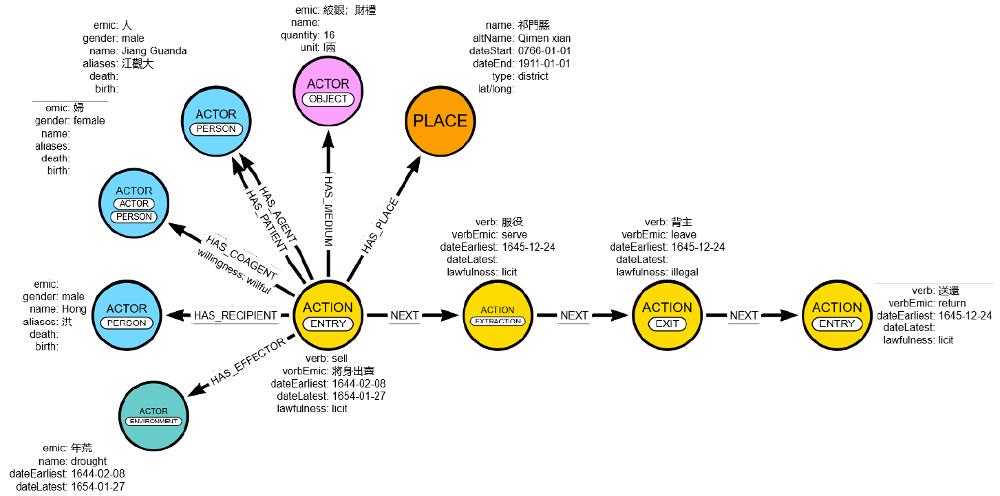

# Relation Types and their Properties

`Relation Types` are central to graph data frameworks as they define the nature of the relations between the entities that populate the graph. Labelling practice should allow near natural language reading of the graph. In GRAM, Relation Types are derived from existing vocabularies when possible, but they will be revised, standardized, and made more interoperable in a next phase. 

At the core of GRAM is the `(Action)-[HAS_ACTOR_WITH_ROLE]->(Actor)` relation, but it also allows (limited and strictly managed) `(Actor)-[]->(Actor)` and `(Action)-[]->(Action)` relations (see Figure below).

> For a description of the nodes/entities, see [GRAM_nodes.md](/GRAM_documentation/GRAM_nodes.md).

### 2.1 Action->Actor Relations

In GRAM, the relations between Actors and Actions are used to record the `Role` of actor entities in actions. To do so, we build on the "Thematic Roles" and "Semantic Roles" ontologies.[^1] Users can make sense of the Action->Actor relation Types as sub-classes of an implicit `HAS_PARTICIPANT` relation. 

> Note that the arbitrary choice was made to have all Action->Actor relations directed from the Action node to the Actor node. Directions may have an their importance when querying the graph!

#### 2.1.1 Action->Actor Relation Types

Action nodes usually have at least one `Agent` and (or) one `Patient`. However, Actors can have several other `Roles` in an Action, which are listed and explained below:

### 2.7 Action->Text Relations

| Action->Actor relation type | Description |
| :--- | :--- |
| `ACCORDING_TO` | Relates an action's `assetId` to the Actor that provides information about it (it thus also provides information about the point of view provided on an action) |
| `HAS_ADDRESSEE` | The actor receives a verbal message through the action and becomes co-knowledgeable |
| `HAS_AGENT` | The actor is the agent of the action (i.e., the active semantic subject) |
| `HAS_BENEFACTIVE` | The actor derives a benefit from the action but is not its agent |
| `HAS_COMITATIVE` | The Actor is a co-agent of the action |
| `HAS_EFFECTOR` | The actor triggers or causes the action but is not the agent (e.g., the Person who orders the action, or an environmental event that causes the action) |
| `HAS_EXPERIENCER` | The actor observes, perceives or senses the action (e.g., a feeling) |
| `HAS_INSTRUMENT` | The (material) actor used to carry out the action (e.g., a knife used to cut a cake) |
| `HAS_MEDIATOR` | The actor serves as an intermediary between the agent and the patient |
| `HAS_MEDIUM` | The material means through which the action is realized (e.g., a contract, an amount of money, a transportation, etc.) |
| `HAS_PATIENT` | The actor is the patient of the action (the semantic object) |
| `HAS_RECIPIENT` | The actor receives an object/patient of the action (as owner) |
| `HAS_RESULT` | The actor is the outcome of the action (e.g., an action "to build" with the result "a house") |
| `HAS_TARGET` | The actor is the target of the emotion or intention of someone |
| `HAS_THEME` | The topic of an action (e.g., of a discussion) |

#### 2.1.2 Action->Actor Relation Properties

In addition to their type, Action->Actor relations can have multiple properties. Generally these should reflect the granularity of the sources, meaning that this information should be recorded only when the information is evident from the source itself. In such instances, Action->Actor relation properties help keep track of more granular contextual information about the relation as provided by the text – like its intensity, the compliance of the actors, the incentives triggering their involvement, or the contextual identities that they may have in the action (e.g., status, title or capacity at the time of the action).

We also suggest using `role qualifiers`. These qualifiers are broad and rudimentary. They will require further categorization based on a larger sample of cases discussed collectively.

> Relation properties always come in pairs: an emic expression and an etic interpretation/translation

| Action->Actor property key | property value | notation | description |
| :--- | :--- | :--- | :--- |
| `capacity` |  | {string array} | Records the capacity, title, position, status, occupation, etc. of a person that is relevant in relation to the action |
| `capacityEmic` |  | {string array} | Emic expressions of the capacity property |
| `compliance` |  | {string array} | Recorded to evaluate the level of compliance or willingness of an Actor |
| `complianceEmic` |  | {string array} | Emic expressions of the compliance property |
| `motivation` |  | {string array} | Records ways in which actors justify their actions, being pretexts, incentives, etc. |
| `motivationEmic` |  | {string array} | Records emic justifications for the action |
| `roleQualif` |  | {string array} | General role qualifiers (to be sorted and classified at a later stage) |
| `roleQualifEmic` |  | {string array} | Emic expressions of the role qualifier |

### 2.2 Action->Action Relations

The main relation type between two action nodes in GRAM is the `NEXT` relationship, which allows to build sequences of actions and thus introduces a crucial dynamic dimension into the graph. In this way, graphs can come to reflect narrative structures of sources, and be used to understand how actions enable other actions.

Other Action->Action relations should be limited to a minimum (to avoid overloading). However, we will have to deal with simultaneous and conditional actions that may (or may not) require specific relation types. 

- With regard to simultaneous actions, we still have to test whether graphing two actions following another one is sufficient to keep track of simultaneousness, or if this requires an additional `SIMULTANEOUS` relation. 

- Conditional actions may also require the use of `IF_YES` and `IF_NOT` relations between actions. This also has to be tested.

#### 2.2.1 Action->Action Relation Types

| Action->Action relation type | Description |
| :--- | :--- |
| `NEXT` | The action which the relationship points to follows (and may be the consequence of) the other action |
| `SAME_AS` | When different source or actors provide different interpretations of the same action, different instances of the action can be related to one another |

#### 2.2.2 Action->Action Relation Properties

At the present stage, we scarcely use Action->Action relation properties. In rare cases, we may have to use an `interval` property of a `NEXT` relation. And we still have to decide whether we want to use `outcome` as a possible property of `NEXT` relations. 

| Action->Action property key | property value | notation | description |
| :--- | :--- | :--- | :--- |
| `interval` |  | {duration} | When an `interval` between two actions is provided but dates are too fuzzy, the interval can be recorded as a property of the `NEXT` relation, using Cypher's duration notation |

### 2.3 Action->Place Relations

An action usually has a Place, be it the location where it happened, the point of origin or destination of a movement action.

#### 2.3.1 Action->Place Relation Types

| Action->Place relation type | Description |
| :--- | :--- |
| `HAS_DESTINATION` | The action has the place as its destination, in case of movement described by the action |
| `HAS_ORIGIN` | The action has the place as its origin, in case of movement described by the action |
| `HAS_PATH` | The action has the place that is crossed in a relocation |
| `TAKES_PLACE` | The action happens at the place |

#### 2.3.2 Action->Place Relations Properties

Locations used in the source can have different levels of certainty. A text may express doubts about the place where an action happened, or about its origin place. The `certainty` property is used when such information needs to be recorded.

| Action->Place property key | property value | notation | description |
| :--- | :--- | :--- | :--- |
| `certainty` | `confirmed`; `doubtful`; `intended` | {string} | the place of an action can either be doubtful, intended, or confirmed (according to the source) |

### 2.4 Actor->Actor Relation

Action->Actor relations are at the core of the model and, in theory, relationships between actors could in most of the cases be mediated through action nodes rather than direct Actor->Actor relations. For instance, being the child or the spouse of a person is the result of giving birth or getting married; a person being part of a larger group entity is also the result of actions (like abduction, birth, pledging membership, etc.); as is the hierarchy between two administrative entities the result of human decisions. However, the actions creating these bonds and hierarchies are often implicit. Mediating them through actions would thus require the creation of artificial action nodes that are not stated in the source documentation. In this regard, we still have to make decisions as to whether we allow the creation of articificial action nodes or a wider range of direct Actor->Actor relations (which could weaken the framework).

#### 2.4.1 Actor->Actor Relation Types

With regard to interpersonal relations, we build on the [Friend of A Friend](https://lov.linkeddata.es/dataset/lov/vocabs/foaf) vocabulary. As much as possible, we want to rely on existing [open vocabularies](https://lov.linkeddata.es/dataset/lov). Currently, the following Actor-to->Actor relations are employed in the data model.

| Actor->Actor relation type | Description |
| :--- | :--- |
| `IS_PART_OF` | Used when a subgroup or a individual entity belongs to a larger `Group` or to a `People` actor |
| `IS_RELATIVE_OF` | Used if a family relationship exists between two actors (the type of relationship is stored in the `relType` property (e.g., sonOf)) |

#### 2.4.2 Actor->Actor Relation Properties

| Actor->Actor property key | property value | notation | description |
| :--- | :--- | :--- | :--- |
| `relType` |  | {string array} | Records the Actor->Actor relation type, if possible based on existing ontologies of interpersonal relation |
| `relTypeEmic` |  | {string array} | Emic expressions of the `relType` property |

### 2.5 Actor->Place Relations

Actors can be bound to Places in ways that cannot be directly related to an action. Such relations should be avoided as much as possible, but when necessary, we may use a `HAS_PLACE` relation coupled with (still to be defined) properties.

#### 2.5.1 Actor->Place Relation Types

| Actor->Place relation type | description |
| :--- | :--- |
| `HAS_PLACE` | Used to specify the place where an actor is usually based, inhabits, or has its seat or headquarter, etc. |

#### 2.5.2 Actor->Place Relation Properties

| Actor->Actor property key | property value | notation | description |
| :--- | :--- | :--- | :--- |
| `relType` |  | {string array} | Records the Actor->Place relation type |
| `relTypeEmic` |  | {string array} | Emic expressions of the `relType` property |

### 2.6 Place->Place Relations

In order to keep track of dependencies between spacial entities, we use Place-to->Place relation types based on existing ontologies (to be specified).

| Place->Place relation type | description |
| :--- | :--- |
| `IS_PART_OF` | Used when a place entity belongs to a larger place entity (a polity, an administrative unit, a natural space) |
